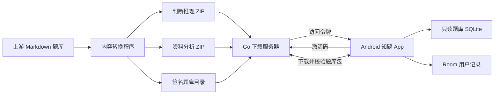

# 知题（Zhiti）

知题是一款面向公务员考试题库的原生 Android 应用。题库按模块下载到设备，下载完成后可离线练习；作答、错题、订正和收藏记录仅保存在本机。

- 当前版本：`1.0.2`
- Android 包名：`com.xiaoyunduo.zhiti`
- 最低系统版本：Android 12（API 31）

## 功能

- 判断推理：图形推理、定义判断、类比推理、逻辑判断和科学推理
- 资料分析：按完整材料及其关联题目练习
- 首页显示专项和完整材料的已完成 / 总数
- 判断推理每组可选 5、10、15 或 20 题
- 答题解析、错题自动收录、订正和收藏
- 当前练习与作答进度恢复
- 两个独立题库模块，可按需下载并离线使用
- 题库断点续传、SHA-256 校验、Ed25519 签名验证和原子更新
- 激活码单设备绑定；服务器不接收作答记录

当前内容包收录 7,703 道判断推理题、3,562 道资料分析题和 717 份材料。详细差异见 [题库审计](docs/DATA-AUDIT.md)。

## 架构



题库数据和用户数据彼此独立。题库更新使用稳定的 `qid` 保留已有作答记录。服务器仅保存激活码、令牌和设备标识的摘要。

更完整的设计见 [架构说明](docs/ARCHITECTURE.md)。

## 仓库结构

```text
.
├── android/               Kotlin 与 Jetpack Compose Android 应用
├── content-pipeline/      题库转换、校验、签名与打包工具
├── server/                Go 激活与内容下载服务
├── infra/                 Docker Compose、证书和部署脚本
├── docs/                  安装、发布、部署、审计与测试文档
├── Makefile               测试命令入口
└── SOURCE-LICENSE.txt     上游题库许可与免责声明
```

以下内容只在本机生成，不纳入 Git：

- `.secrets/`：CA、服务器证书、内容签名私钥和 APK 发布密钥
- `content-pipeline/build/`：SQLite、题库 ZIP、目录、签名和审计报告
- `dist/`：发布 APK、摘要和交付信息
- `infra/runtime/`：服务运行数据

## 环境要求

| 组件 | 要求 |
| --- | --- |
| Android 构建 | JDK 17、Android SDK 37 |
| Gradle | 9.4.1，使用仓库内 Wrapper |
| Android Gradle Plugin | 9.2.0 |
| Kotlin | 2.2.10 |
| 内容构建 | Python 3、OpenSSL |
| 服务构建 | Go 1.25 |
| 部署 | Docker Engine、Docker Compose、SSH、rsync |

首次构建 Android 应用前，在 `android/local.properties` 中配置 Android SDK，或设置 `ANDROID_HOME`。

## 获取源代码

```bash
git clone <repository-url> zhiti
cd zhiti
```

本仓库不包含题库 ZIP、发布 APK 或私钥。首次完整构建需要另行准备固定版本的上游题库：

```text
ERRRC/kaogongzhentizhengliu
commit 84ab93d4b64b61d897bece8a1c0a5bab06b4feb2
```

## 运行测试

在仓库根目录执行：

```bash
make test
```

该命令运行内容管线和 Go 服务测试。Android 单元测试单独执行：

```bash
make android-test
```

也可以分别运行：

```bash
make pipeline-test
make server-test
```

已验证的测试范围和设备限制见 [测试报告](docs/TEST-REPORT.md)。

## 生成本地密钥

以下命令会在 `.secrets/` 生成私有 CA、服务器证书、内容签名密钥和 Android 发布密钥，并把两个公钥复制到 Android 资源目录：

```bash
infra/scripts/create-secrets.sh
```

`.secrets/` 已被 Git 忽略。发布密钥丢失后无法覆盖升级已安装的应用，应保留离线备份。

## 构建题库

```bash
python3 content-pipeline/build_content.py \
  --source /path/to/kaogongzhentizhengliu \
  --output content-pipeline/build \
  --version 2026.09.1 \
  --base-url https://example.com/v1/packs \
  --signing-key .secrets/content-ed25519-private.pem
```

输出包括：

```text
content-pipeline/build/
├── judgment-2026.09.1.zip
├── data-analysis-2026.09.1.zip
├── catalog.json
├── catalog.sig
└── audit.json
```

验证单个题库包：

```bash
python3 content-pipeline/verify_pack.py \
  content-pipeline/build/judgment-2026.09.1.zip
```

相同输入会生成字节一致的 ZIP。转换失败或被排除的题目会记录在 `audit.json`，不会静默丢弃。

## 构建 Android 应用

构建 Debug APK：

```bash
cd android
./gradlew assembleDebug
```

输出：

```text
android/app/build/outputs/apk/debug/app-debug.apk
```

构建并检查签名 Release APK：

```bash
cd android
./gradlew clean test lintDebug assembleRelease
```

Release 构建读取 `.secrets/release.env`。输出：

```text
android/app/build/outputs/apk/release/app-release.apk
```

发布步骤、摘要生成和证书指纹检查见 [发布说明](docs/RELEASE.md)。侧载与覆盖升级方法见 [安装说明](docs/INSTALL.md)。

## 运行服务

服务通过环境变量配置。至少需要一个长度不小于 32 字符的 `ZHITI_PEPPER`：

```bash
export ZHITI_PEPPER='replace-with-at-least-32-random-characters'
export ZHITI_ADDRESS=':8443'
export ZHITI_STATE_PATH='data/state.json'
export ZHITI_CONTENT_DIR='../content-pipeline/build'
export ZHITI_CATALOG_PATH='../content-pipeline/build/catalog.json'
export ZHITI_CATALOG_SIG='../content-pipeline/build/catalog.sig'
export ZHITI_TLS_CERT='../.secrets/server.crt'
export ZHITI_TLS_KEY='../.secrets/server.key'
cd server
go run ./cmd/zhiti-server
```

默认配置：

| 环境变量 | 默认值 | 说明 |
| --- | --- | --- |
| `ZHITI_ADDRESS` | `:443` | HTTPS 监听地址 |
| `ZHITI_STATE_PATH` | `/data/state.json` | 激活状态文件 |
| `ZHITI_CONTENT_DIR` | `/content` | 题库包目录 |
| `ZHITI_CATALOG_PATH` | `/content/catalog.json` | 内容目录 |
| `ZHITI_CATALOG_SIG` | `/content/catalog.sig` | 目录签名 |
| `ZHITI_TLS_CERT` | `/run/secrets/server.crt` | TLS 证书 |
| `ZHITI_TLS_KEY` | `/run/secrets/server.key` | TLS 私钥 |
| `ZHITI_PEPPER` | 无 | 摘要加盐，至少 32 字符 |

API：

| 方法 | 路径 | 用途 |
| --- | --- | --- |
| `POST` | `/v1/activate` | 激活设备并签发访问令牌 |
| `GET` | `/v1/catalog` | 获取签名内容目录 |
| `GET` | `/v1/packs/{packId}/{version}` | 鉴权下载题库包 |
| `GET` | `/healthz` | 健康检查 |

本地生成激活码：

```bash
export ZHITI_PEPPER='replace-with-at-least-32-random-characters'
cd server
go run ./cmd/zhiti-admin create \
  --state data/state.json \
  --count 1
```

生产环境通过 `infra/docker-compose.yml` 运行。完整部署、吊销、解绑和备份命令见 [服务器运维](docs/SERVER.md)。

## 安全与隐私

- 作答、错题、收藏和练习进度只存储在 Android 设备的 Room 数据库中。
- 服务端只保存激活码、令牌和设备标识的加盐摘要。
- 内容目录使用 Ed25519 签名；题库包使用 SHA-256 校验。
- HTTPS 使用应用内置的私有 CA 信任锚。
- 私钥、发布 APK、题库包和运行状态均由 `.gitignore` 排除。
- 日志不记录激活码、访问令牌或完整设备标识。

## 文档

- [架构说明](docs/ARCHITECTURE.md)
- [题库审计](docs/DATA-AUDIT.md)
- [APK 安装](docs/INSTALL.md)
- [发布构建](docs/RELEASE.md)
- [服务器部署与维护](docs/SERVER.md)
- [测试报告](docs/TEST-REPORT.md)
- [Android 有限分发](docs/LIMITED_DISTRIBUTION.md)

## 数据来源与许可

题库来源为 [ERRRC/kaogongzhentizhengliu](https://github.com/ERRRC/kaogongzhentizhengliu)，构建固定在提交 `84ab93d4b64b61d897bece8a1c0a5bab06b4feb2`。

上游整理内容采用 CC BY-NC 4.0；真题题干、选项、材料和图片的权利归原出题机构或原出版方。署名、非商业使用条件及免责声明见 [SOURCE-LICENSE.txt](SOURCE-LICENSE.txt)。

本仓库尚未为应用代码单独声明开源许可证。在许可证明确前，不能仅依据题库内容的 CC BY-NC 4.0 推定应用代码也采用该许可证。
